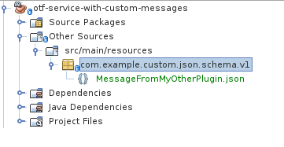

<!--

     Copyright (c) 2020 - 2022 Henix, henix.fr

     Licensed under the Apache License, Version 2.0 (the "License");
     you may not use this file except in compliance with the License.
     You may obtain a copy of the License at

         http://www.apache.org/licenses/LICENSE-2.0

     Unless required by applicable law or agreed to in writing, software
     distributed under the License is distributed on an "AS IS" BASIS,
     WITHOUT WARRANTIES OR CONDITIONS OF ANY KIND, either express or implied.
     See the License for the specific language governing permissions and
     limitations under the License.

-->
# OpenTestFactory Java toolkit

## Writing a Java-based OTF plugin

### pom setup [WIP]

The Java toolkit lets you define Java-based OTF plugins using springboot.
Your pom must have `spring-boot-starter-PARENT:2.3.4` as its parent pom, and add the `spring-boot-maven-plugin` to its build plugin setup:

```XML
<project xmlns="http://maven.apache.org/POM/4.0.0" xmlns:xsi="http://www.w3.org/2001/XMLSchema-instance" xsi:schemaLocation="http://maven.apache.org/POM/4.0.0 http://maven.apache.org/xsd/maven-4.0.0.xsd">
    <modelVersion>4.0.0</modelVersion>
    <parent>
        <groupId>org.springframework.boot</groupId>
        <artifactId>spring-boot-starter-parent</artifactId>
        <version>2.3.4.RELEASE</version>
        <relativePath /> <!-- lookup parent from repository -->
    </parent>
    <groupId>org.opentestfactory</groupId>
    <artifactId>otf-template-microservice</artifactId>
    <version>0.0.1-SNAPSHOT</version>
<!-- [...] -->
	<build>
		<plugins>
			<plugin>
				<groupId>org.springframework.boot</groupId>
				<artifactId>spring-boot-maven-plugin</artifactId>
			</plugin>
		</plugins>
	</build>
	<!-- [...] -->
</project>
```

### Setting message validation up

Message validation is supported by a component from the `tf-microservice-components` library.
To set this up, you need to let it know about expected message kinds.

This is done by adding the `@ExpectedKind` annotation, defined by the Java toolkit, 
to your inbox method.

#### Most common case: inbox expecting an OTF message in the current version

In this case, you just need to specify the message kind as annotation value. Below is an example for a generator plugin inbox:

```java
   @POST
   @Consumes(MediaType.APPLICATION_JSON)
   @Produces(MediaType.APPLICATION_JSON)
   @Path("/inbox")
   @ExpectedKind("GeneratorCommand")
   public GeneratorJobStatus incomingEvent(GeneratorCommand command){
```

#### Legacy compatibility inbox

If you need to write an inbox method for a previous apiVersion for legacy compatibility, you'll need to add the optional apiVersion attribute

```java
   @POST
   @Consumes(MediaType.APPLICATION_JSON)
   @Produces(MediaType.APPLICATION_JSON)
   @Path("/inbox")
   @ExpectedKind(
      value="GeneratorCommand", 
      apiVersion="opentestfactory.org/v0"
   )
   public GeneratorJobStatus incomingEvent(GeneratorCommand command){
```

#### Inbox for a custom message received by your plugin

In this case, you will annotate the inbox method as for a legacy version, but you will also need to include the json schema file as a resource. This resource will live in a package named as follows:

`<inverted namespace parts>.json.schema.<version part>`

For example, for the message of kind `MessageFromMyOtherPlugin` in namespace `custom.example.com`, version 1:

* Inbox annotation:

  ```java
     @POST
     @Consumes(MediaType.APPLICATION_JSON)
     @Produces(MediaType.APPLICATION_JSON)
     @Path("/inbox")
     @ExpectedKind(
        value="MessageFromMyOtherPlugin",
        apiVersion="custom.example.com/v1"
     )
     public Status incomingEvent(MessageFromMyOtherPlugin command){
  ```

* Schema resource:
  The package name will be `com.example.custom.json.schema.v1`
  
  
  To integrate, messages need at least to provide the `kind` and `apiVersion` properties:
  
  ```json
     {
       "$schema": "http://json-schema.org/draft/2019-09/schema#",
       "title": "JSON SCHEMA for custom.example.com/v1 MessageFromMyOtherPlugin manifests",
       "type": "object",
       "properties": {
           "apiVersion": {"type": "string"}, "pattern": "^custom.example.com/v1$"},
           "kind": {"type": "string", "pattern": "^MessageFromMyOtherPlugin"},
       "content": {"type": "string"}
      }
   ```

### Integration tests

This toolkit project provides an integration test harness based on junit and MockServer. It is described [here](test-harness-tools/src/main/doc/index.md).

This harness allows you to write integration tests based on Junit to check that specific messages are emitted,
or that some messages like ExecutionError messages are NOT emitted,
as a response to one or more incoming messages on the event bus